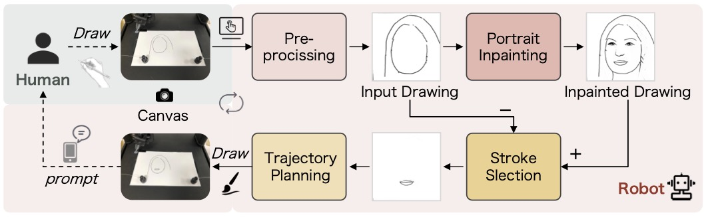
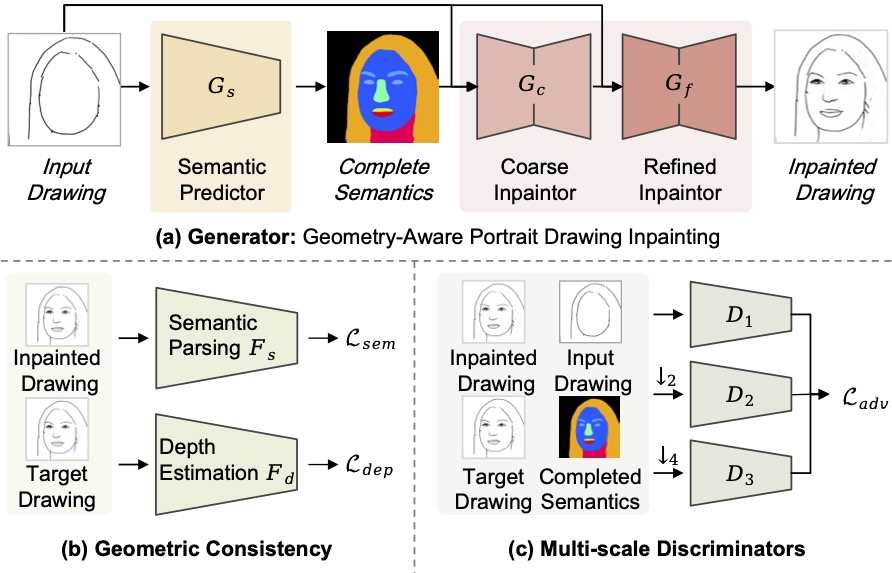
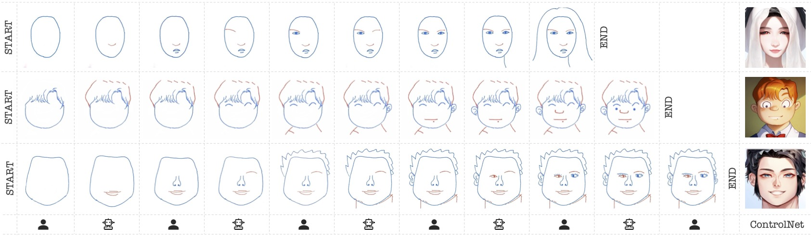
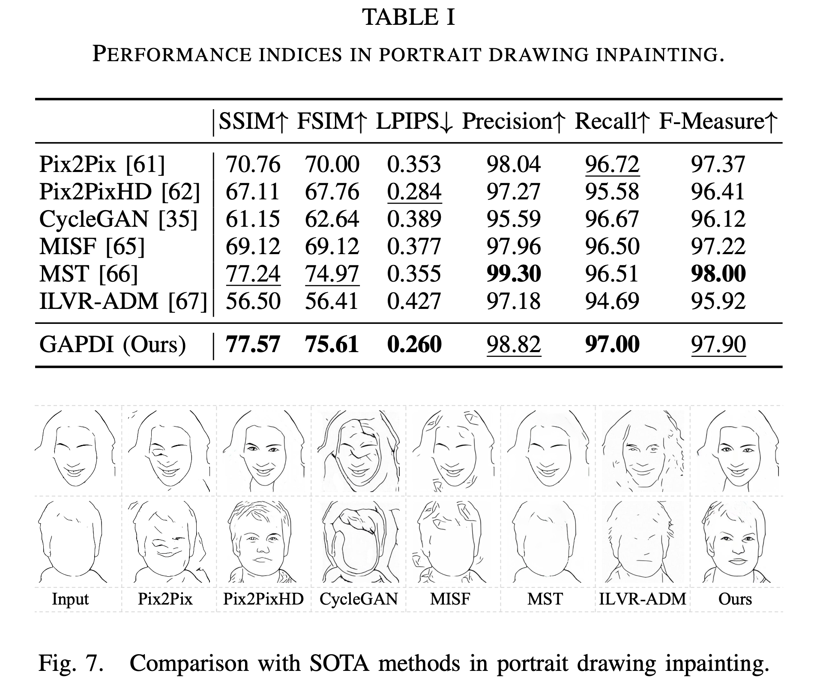

# HRICA
[ICRA'24] Human-Robot Interactive Creation of Artistic Portrait Drawings

[](https://github.com/fei-aiart/HRICA/)
[]()
[]()
[](https://badges.toozhao.com/stats/01HK9CDZTS7T8NVHKHGJB3QZSZ "Get your own page views count badge on badges.toozhao.com")

人机协同创作艺术画像：
- 1 个新的数据集 CelebLine：利用 AiSketcher + Simplify 将 CelebAMask-HQ 转换为新的线条画数据集
- 1 个新的画像补全算法 GAPDI：Mask-Free 和 结构感知的图像补全算法
- 1 个新的人机系统创作系统 HRICA：人和机器人，协同操作界面，ControlNet扩展

## Paper Information

**Fei Gao**, Lingna Dai, Jingjie Zhu, Mei Du, Yiyuan Zhang, Maoying Qiao, Chenghao Xia, Nannan Wang, and Peng Li \*，
Human-Robot Interactive Creation of Artistic Portrait Drawings, 
2024 IEEE International Conference on Robotics and Automation (ICRA), 11297-11304, May13-17, 2024, Yokohama, Japan. 
(\* Corresponding Author)
[[paper]](https://ieeexplore.ieee.org/abstract/document/10611451) ~ [[project]](https://github.com/fei-aiart/HRICA)

## Abstract

In this paper, we present a novel system for *Human-Robot Interactive Creation of Artworks* (HRICA). Different from previous robot painters, HRICA allows a human user and a robot to alternately draw strokes on a canvas, to collaboratively create a portrait drawing through frequent interactions. 

Our main contributions are summarized as follows:

- **Framework.** We propose a novel `HRICA` framework for human-robot interactive creation of artworks, with alternate and frequent interactions.  

- **Dataset.** We construct a novel `CelebLine` dataset, which composes of 30,000 high-quality portrait line-drawings, with labels of semantic parsing masks and depth maps. We hope CelebLine will serve as a benchmark for downsteam visual analysis tasks. 

- **Method.** We propose a novel *mask-free* portrait drawing inpainting method, `GAPDI`, to enable the robot to understand human creating intentions. Experiments show that GAPDI can precisely complete a portrait drawing, and significantly outperforms existing advanced methods.

- **System.** We develop a human-robot interactive drawing system, with low-cost hardware, user-friendly interface, fluent interactive creation process, and rich fun.


## Pipeline

### System: HRICA


### Method: GAPDI 



## Results




## Prerequisites

- Linux or macOS
- Python 3.6.5
- CPU or NVIDIA GPU + CUDA CuDNN

## Getting Started

### Installation

- Clone this repo:

  ```
  git clone https://github.com/fei-aiart/HRICA.git
  cd HRICA
  ```

- You can install all the dependencies by:

  ```
  pip install  -r requirements.txt
  ```

### Train

#### Dataset

- Download our `CelebaLine dataset` [[GoogleDrive]](https://drive.google.com/file/d/1tbMixKuUS1WcdqjfSLSHMZ_0U1McYAq6/view?usp=sharing),[[baidu,提取码: rzw9]](https://pan.baidu.com/s/1PtwlFbGbjFm9cBEsVT-Hvg ) and copy content to `./datasets` folder.
  - Split the data set by [`CelebA_list_eval_partition.txt `]([Large-scale CelebFaces Attributes (CelebA) Dataset](https://link.zhihu.com/?target=http%3A//mmlab.ie.cuhk.edu.hk/projects/CelebA.html)) and `CelebAMask-HQ-attribute-anno.txt`. See the code `./datasets/split.py` .
- Use our pre-trained depth model to generate the depth corresponding to the celebaLine dataset. You can download `depth`use [[GoogleDrive]](https://drive.google.com/file/d/1dl9a9TJDrRoUf2nHIaOAlMuMASyxHXNF/view?usp=sharing), [[baidu,提取码: 8apk]](https://pan.baidu.com/s/1E5ZgxoSEOUf8VjuvIQK4OA)，then put it in the `./datasets/CelebaLine` folder. 
- Download [CelebaMask-HQ](https://drive.google.com/file/d/1badu11NqxGf6qM3PTTooQDJvQbejgbTv/view). The parsing in the original dataset is need to be preprocessed, and the masks of the original 19 parts of the face are processed into one channel, which combines the ` l_brow` and `r_brow`, the `l_eye` and `r_eye`, and `r_ear` and `l_ear`. See parsing example: `./datasets/CelebaLine/train/parsing`.

#### Model

- Download our pre-trained ` depth model`[[GoogleDrive]](https://drive.google.com/file/d/179TZDi9LO-fFjjv5QvDiHkyVtxAT7yWV/view?usp=sharing),  [[baidu,提取码: 8vjg]](https://pan.baidu.com/s/1BHWDQPkU2netxZqqbdATIw )and copy content to `./checkpoints/` folder.

- Download our pre-trained `sketch_parsing model` [[GoogleDrive]](https://drive.google.com/drive/folders/1fo4zh3WZsVOCYMZrKGYtveQSYzPNfNhA?usp=drive_link), [[baidu,提取码: 623m]](https://pan.baidu.com/s/1OW-ZWDb5yL-SjE52Os58GA) and copy content  `./checkpoints` folder.

- Train a model

  ```python
  python train.py --no_flip  --resize_or_crop resize_and_crop    --name pix2pixHDBuQuanSpade2.2.3.2 --geom_loss --global_l1loss --poolformer_loss --gpu_ids 1  --loadSize 286 --fineSize 256 --netG stack
  ```

### Test

- The final model will save at `./checkpoints/pix2pixHDBuQuanSpade2.2.3.2/`. Download model [[GoogleDrive]](https://drive.google.com/file/d/1d_kLVO5gr0fpaxBr1SqzsJ4ttf0dHPhx/view?usp=sharing), [[baidu,提取码: mqbs]](https://pan.baidu.com/s/1ilwt-7M99FxrQ2jy92z2MQ).

- Before testing, you need to use `./data/randomErasing.py` to generate randomly erased line drawings like `./datasets/CelebaLine/test/SimplifySketch_erased`.

  ```
  python ./data/randomErasing.py
  ```

- Final, test with the following command:

  ```
  python test.py --no_flip --resize_or_crop resize  --name pix2pixHDBuQuanSpade2.2.3.2 --gpu_ids 1  --loadSize 256 --geom_loss --global_l1loss --poolformer_loss --which_epoch latest  --netG stack
  ```

- The results will save at `./results/pix2pixHDBuQuanSpade2.2.3.2/test_latest/images`.

### Inference

- If you use other  dataset for testing, you can use:

  ```
  python ./test_myinference.py
  ```


## Citation

```bib
@inproceedings{hrica_icra2024,
  title={Human-Robot Interactive Creation of Artistic Portrait Drawings},
  author={Fei, Gao and Lingna, Dai and Jingjie, Zhu and Mei, Du and Yiyuan, Zhang and Maoying, Qiao and Chenghao, Xia and Nannan, Wang and Peng, Li},
  booktitle={2024 IEEE International Conference on Robotics and Automation (ICRA)},
  pages={1--8},
  year={2024},
  organization={IEEE}
}

```

## Acknowledgement

Our code is inspired by [pix2pixHD](https://github.com/NVIDIA/pix2pixHD), [CA-GAN](https://github.com/fei-aiart/ca-gan), and [GENRE](https://github.com/fei-aiart/genre).

