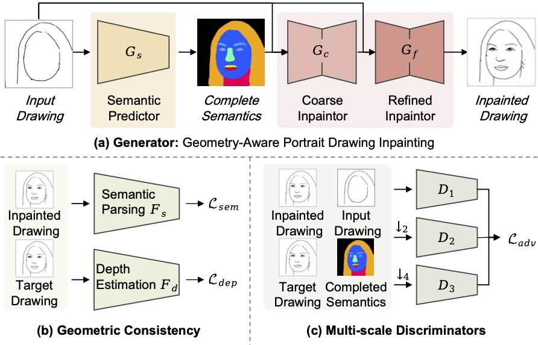
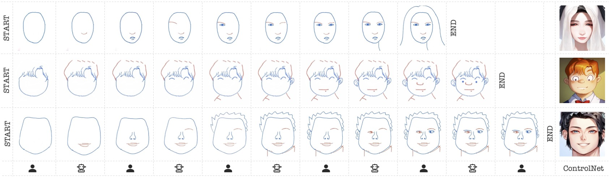
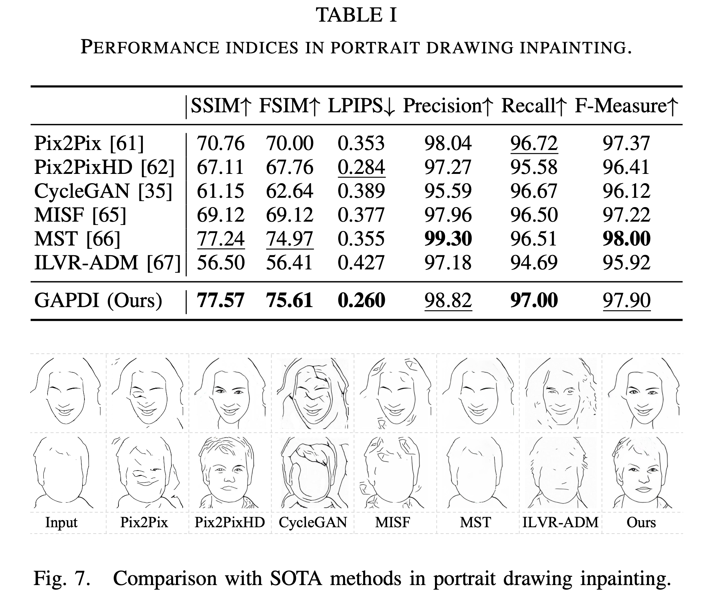

# HRICA
[ICRA'24] Human-Robot Interactive Creation of Artistic Portrait Drawings

[](https://github.com/fei-aiart/HRICA/)
[]()
[]()
[](https://badges.toozhao.com/stats/01HK9CDZTS7T8NVHKHGJB3QZSZ "Get your own page views count badge on badges.toozhao.com")

人机协同创作艺术画像：
- 1 个新的数据集 CelebLine：利用 AiSketcher + Simplify 将 CelebAMask-HQ 转换为新的线条画数据集
- 1 个新的画像补全算法 GAPDI：Mask-Free 和 结构感知的图像补全算法
- 1 个新的人机系统创作系统 HRICA：人和机器人，协同操作界面，ControlNet扩展

## Paper Information

Fei Gao, Lingna Dai, Jingjie Zhu, Mei Du, Yiyuan Zhang, Maoying Qiao, Chenghao Xia, Nannan Wang, and Peng Li \*，
Human-Robot Interactive Creation of Artistic Portrait Drawings, 
2024 IEEE International Conference on Robotics and Automation (ICRA), accepted, May13-17, 2024, Yokohama, Japan. 
(\* Corresponding Author)

## Abstract

In this paper, we present a novel system for *Human-Robot Interactive Creation of Artworks* (HRICA). Different from previous robot painters, HRICA allows a human user and a robot to alternately draw strokes on a canvas, to collaboratively create a portrait drawing through frequent interactions. 

Our main contributions are summarized as follows:

- **Framework.** We propose a novel `HRICA` framework for human-robot interactive creation of artworks, with alternate and frequent interactions.  

- **Dataset.** We construct a novel `CelebLine` dataset, which composes of 30,000 high-quality portrait line-drawings, with labels of semantic parsing masks and depth maps. We hope CelebLine will serve as a benchmark for downsteam visual analysis tasks. 

- **Method.** We propose a novel *mask-free* portrait drawing inpainting method, `GAPDI`, to enable the robot to understand human creating intentions. Experiments show that GAPDI can precisely complete a portrait drawing, and significantly outperforms existing advanced methods.

- **System.** We develop a human-robot interactive drawing system, with low-cost hardware, user-friendly interface, fluent interactive creation process, and rich fun.


## Pipeline

### System: HRICA


### Method: GAPDI 



## Results





## Citation
```bib
@inproceedings{hrica_icra2024,
  title={Human-Robot Interactive Creation of Artistic Portrait Drawings},
  author={Fei, Gao and Lingna, Dai and Jingjie, Zhu and Mei, Du and Yiyuan, Zhang and Maoying, Qiao and Chenghao, Xia and Nannan, Wang and Peng, Li},
  booktitle={2024 IEEE International Conference on Robotics and Automation (ICRA)},
  pages={1--8},
  year={2024},
  organization={IEEE}
}

``` 

## Acknowledgement
